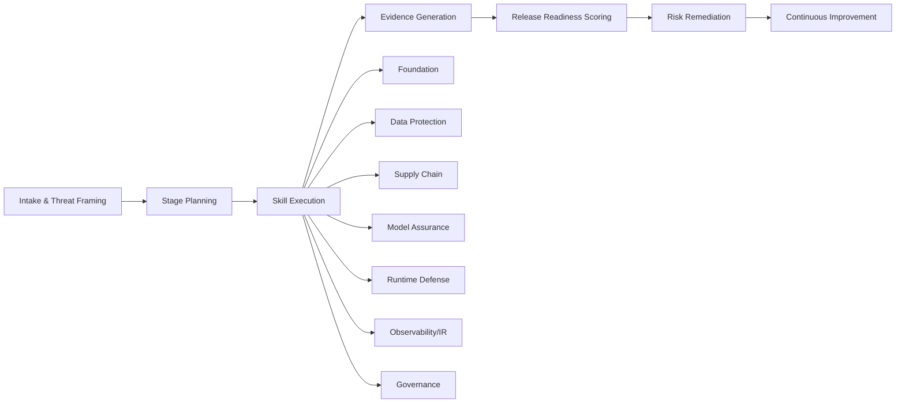

# MLSecOps Engineering Skills

_Operational security playbooks for the ML/LLM lifecycle: threat modeling, supply-chain defense, assurance, runtime controls, observability, and governance._


---

## What this repo is

This repository is a **skill-driven MLSecOps framework** with practical, execution-ready security workflows.  
Each skill is a standalone module with:

- a concise `SKILL.md` operating guide,
- reusable scripts that generate evidence artifacts,
- references to open-source tools and integrations.

The design goal is simple: move from “security ideas” to **verifiable release evidence**.

## Why this is useful

- Detect and close risk paths before release.
- Keep security checks repeatable across projects.
- Prevent blind spots in data, model, runtime, and governance controls.
- Treat **malicious prompt/skill abuse and malicious artifacts** as first-class release blockers.

---

## Repository at a glance



---

## Skills

| Skill | Purpose | Primary Output |
|---|---|---|
| [mlsecops-codex-orchestrator](skills/mlsecops-codex-orchestrator/SKILL.md) | Convert a project into an ordered security program and artifact set | `task.md`, readiness score, bootstrap summary |
| [mlsecops-foundation](skills/mlsecops-foundation/SKILL.md) | Threat modeling, trust boundaries, and control baseline | `threat-register.md` |
| [mlsecops-data-protection](skills/mlsecops-data-protection/SKILL.md) | Data provenance, poisoning controls, privacy gates | `data-control-matrix.md` |
| [mlsecops-supply-chain](skills/mlsecops-supply-chain/SKILL.md) | Artifact, dependency, and CI/CD integrity controls | `supply-chain-checklist.md`, scan report |
| [mlsecops-model-assurance](skills/mlsecops-model-assurance/SKILL.md) | Robustness, extraction, jailbreak, and abuse testing | `model-assurance-matrix.md` |
| [mlsecops-runtime-defense](skills/mlsecops-runtime-defense/SKILL.md) | Runtime abuse controls, allowlists, and fail-closed behavior | `runtime-defense-baseline.md` |
| [mlsecops-observability-ir](skills/mlsecops-observability-ir/SKILL.md) | Telemetry schema, detections, and incident runbooks | `incident-playbook.md` |
| [mlsecops-governance](skills/mlsecops-governance/SKILL.md) | Evidence mapping, control ownership, and exception control | `evidence-register.md` |

---

## One-screen workflow (run this first)

```bash
python skills/mlsecops-codex-orchestrator/scripts/generate_task_plan.py \
  --project-name "<project>" \
  --system-summary "<summary>" \
  --risk-profile high \
  --compliance "SOC2,ISO27001,NIST AI RMF" \
  --output task.md

python skills/mlsecops-codex-orchestrator/scripts/bootstrap_mlsecops_artifacts.py \
  --project-name "<project>" \
  --system-summary "<summary>" \
  --risk-profile high \
  --output-dir mlsecops-artifacts

python skills/mlsecops-codex-orchestrator/scripts/score_release_readiness.py \
  --artifact-dir mlsecops-artifacts \
  --output mlsecops-artifacts/release-readiness.md
```

### Output you should expect

- `task.md`  
- `threat-register.md`  
- `data-control-matrix.md`  
- `supply-chain-checklist.md`  
- `model-assurance-matrix.md`  
- `runtime-defense-baseline.md`  
- `incident-playbook.md`  
- `evidence-register.md`  
- `mlsecops-artifacts/release-readiness.md`  
- `mlsecops-artifacts/bootstrap-summary.md`  

## GitHub remote setup

If this project cannot pull, initialize git + configure `origin` with:

```bash
chmod +x scripts/setup-github-remote.sh
./scripts/setup-github-remote.sh "https://github.com/<owner>/<repo>.git"
```

Then pull your default branch with a fast-forward strategy:

```bash
git pull --ff-only origin main
```

If you need to push later, run:

```bash
git push -u origin main
```

If push fails with `could not read Username`, GitHub credentials are not configured for this machine/session. Pick one of these:

```bash
# HTTPS auth helper (stores a token/credential in OS keychain)
git config --global credential.helper osxkeychain

# Or switch to SSH remotes for token-less local setup
git remote set-url origin git@github.com:<owner>/<repo>.git
```

---

## Core scripts

```text
skills/mlsecops-foundation/scripts/
  - generate_threat_register.py
  - run_open_source_foundation_checks.py

skills/mlsecops-data-protection/scripts/
  - generate_data_control_matrix.py
  - run_open_source_data_checks.py

skills/mlsecops-supply-chain/scripts/
  - generate_supply_chain_checklist.py
  - run_open_source_scans.py

skills/mlsecops-model-assurance/scripts/
  - generate_assurance_matrix.py

skills/mlsecops-runtime-defense/scripts/
  - generate_runtime_baseline.py

skills/mlsecops-observability-ir/scripts/
  - generate_ir_playbook.py

skills/mlsecops-governance/scripts/
  - generate_evidence_register.py

skills/mlsecops-codex-orchestrator/scripts/
  - generate_task_plan.py
  - bootstrap_mlsecops_artifacts.py
  - score_release_readiness.py
  - mcp_tool_probe.py
```

---

## Problems this framework detects

- **Threat and architecture gaps**: missing boundaries, unowned exposures, unmanaged external interfaces.
- **Data risks**: leakage, poisoning, weak lineage, and retention non-compliance.
- **Supply-chain abuse**: dependency drift, secret exposure, unsafe model formats, unverifiable promotion.
- **Prompt and skill abuse**: jailbreak, prompt-tool exploitation, dangerous artifact loading.
- **Model robustness gaps**: evasion regression, extraction indicators, privacy leakage.
- **Runtime abuse**: auth bypass, rate-limit abuse, malformed payload execution attempts.
- **Governance failures**: stale exceptions, weak evidence mapping, missing control owner cadence.

---

## Repository structure

- `skills/` — skill modules with operational playbooks and scripts
- `security-fixtures/` — curated fixtures for controlled experiments
- `threat-register.md` — baseline threat catalog example
- `hardening-backlog.md` — security backlog and gate planning

---

## Contributing to this repo

1. Keep the same style across all `SKILL.md` files:
   - clear goal,
   - required inputs,
   - step-by-step workflow,
   - what can be detected,
   - outputs,
   - quality gates,
   - commands.
2. Add/adjust open-source references with one-line checks and links.
3. Keep all scripts deterministic and artifact-oriented.
4. Preserve evidence-first thinking: every new control should create traceable output.

---

## Notes

- This repo is intentionally security-engineering first, not documentation-only.
- Security evidence is treated as release-relevant output, not a retrospective checklist.
- Prompt/tool abuse and artifact integrity are part of the shared release contract across all skills.
- Inspired by the [MLOps Coding Course](https://github.com/MLOps-Courses/mlops-coding-course), we build MLSecOps skills.
